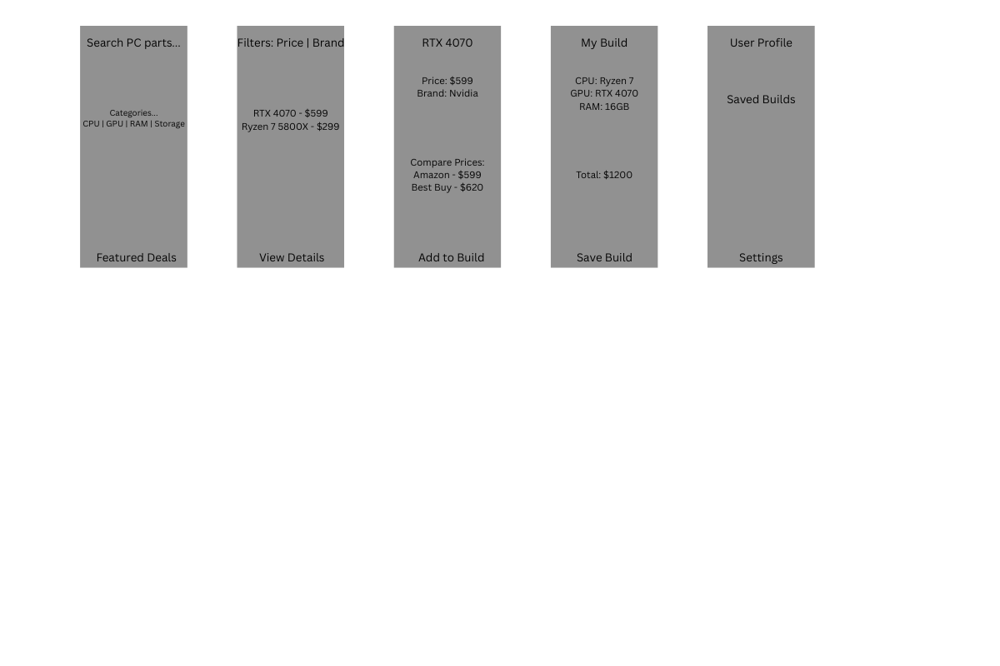

# RigBuilder

Android app for comparing PC part prices and building custom rigs.

---

## Project Description
RigBuilder is an Android mobile application designed to assist users in building custom personal computers by providing a centralized platform for browsing, comparing, and selecting PC components. The application allows users to explore hardware options, view detailed specifications, and assemble a custom build while tracking total cost. The app also includes a compatibility checking system to ensure selected components work together.

---

## Problem Being Addressed
Building a custom PC requires comparing components, evaluating specifications, and ensuring compatibility between parts. This process can be time-consuming and confusing, especially for beginners.

RigBuilder addresses these challenges by:
- Organizing PC components into categories
- Providing search and filtering tools
- Allowing users to build and manage a custom PC configuration
- Enforcing one-part-per-category selection logic
- Implementing compatibility checks between CPU and motherboard components

---

## Platform
- Android (Primary platform)
- Developed using Android Studio
- Programming Language: Kotlin
- UI Design: XML Layouts
- Version Control: GitHub

---

## Front-End and Back-End Support

### Front-End
- Built using XML layouts and Kotlin
- RecyclerView for dynamic part listings
- Interactive UI components (buttons, search bar, filters)
- Multiple activities:
  - MainActivity (part listing)
  - DetailActivity (part details)
  - BuildActivity (custom build view)

### Back-End
- Local mock data for PC components
- Kotlin data classes for data modeling
- Centralized build management using `BuildManager`
- No external database integration (planned for future)

---

## Functionality
RigBuilder currently includes:

- Display list of PC components
- Search parts by name, brand, or category
- Filter parts by category (CPU, GPU, RAM, Storage, etc.)
- View detailed part information
- Add parts to a custom build
- Replace parts within the same category
- View selected build components
- Remove individual parts from build
- Clear entire build
- Calculate total build cost
- Check compatibility between CPU and motherboard (socket-based)

## Design Wireframes
Wireframes show the planned layout for:
- Home screen
- Product listing screen
- Product detail screen
- Build planner screen
- User profile screen

## Technologies Used
- Android Studio
- Kotlin
- XML layouts
- RecyclerView
- Android SDK
- Local mock data

## Wiki
https://github.com/tyler-albano/RigBuilder/wiki/Outline
